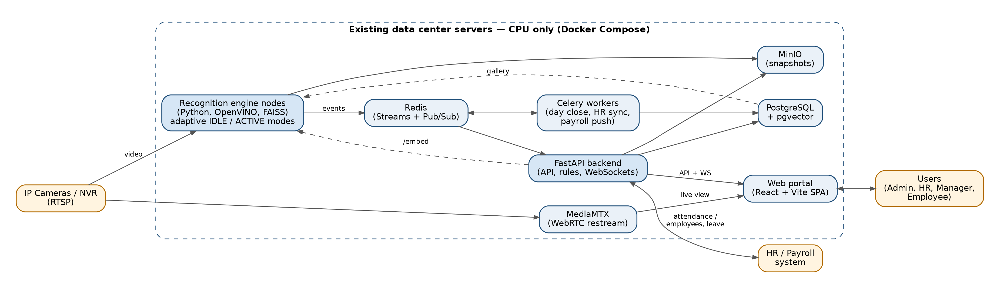

## 1. Document purpose and how to use it

This document is the single source of truth for building FaceTrack, a system that watches existing office CCTV feeds, recognises enrolled employees by face and marks their attendance automatically. It is written so that a developer or an AI coding agent can build the product phase by phase without further briefing.

| **Item** | **Value** |
|:---|:---|
| Document type | Software Requirements Specification + Technical Proposal |
| Version | 1.2 (draft) — FastAPI + React stack; CPU-only deployment on existing data center servers |
| Owner | Ehtisham Nasir, ITRC (Atlas IT Resource Center) |
| Intended readers | ITRC management, developers, AI coding agents, HR, Information Security |
| Requirement IDs | FR-x (functional), NFR-x (non-functional), AC-x (acceptance) |

Keywords **MUST**, **SHOULD** and **MAY** follow RFC 2119 meaning. Anything not stated here is a decision for the owner; agents must list it as an open question rather than guess (see section 21).

## 2. Executive summary

FaceTrack replaces manual and card-based attendance with touchless, camera-based attendance that needs no action from the employee. It reuses the office’s existing IP cameras and NVR, runs on the existing data center servers using CPU only (no GPU), uses lightweight pre-trained face models with an adaptive processing pipeline, and pushes final attendance into the existing HR/payroll system.

**Business objectives**

1.  Eliminate buddy punching and proxy attendance.
2.  Remove queues and touch at biometric devices.
3.  Give HR real-time presence data (who is in office now, late arrivals, early exits).
4.  Feed clean daily attendance into payroll automatically, removing manual reconciliation.
5.  Keep a full audit trail with a snapshot as evidence for every attendance event.

**Approach in one line:** detect faces in camera frames, convert each face into a 512-number embedding with a pre-trained model, compare it with enrolled employee embeddings, then apply attendance rules. No model is trained from scratch.

## 3. Scope

**In scope (v1)**

- Live ingestion of RTSP streams from existing IP cameras / NVR.
- Face detection, recognition and tracking on a local on-premise server.
- Employee enrollment (photo upload, webcam capture, bulk import).
- Attendance rules: check-in, check-out, late, early exit, absent, shifts, holidays.
- Web admin portal: dashboard, live view, employees, cameras, attendance, reports, settings, audit log.
- Manual correction workflow with reason and approval.
- Unknown-face log for review.
- REST API and scheduled sync to the HR/payroll system.
- Excel/PDF reports and email notifications.

**Out of scope (v1)**

- Training a custom face model from scratch.
- Visitor management, access control (door locks) and mobile app. These MAY come in v2.
- Emotion, age or behaviour analytics. These are explicitly excluded for privacy reasons.
- Cloud processing of video. All video stays on-premise.

**Assumptions**

- Cameras support RTSP (H.264/H.265) and are reachable from the server’s network.
- Each employee has a unique Employee Code that matches the HR/payroll system.
- HR will obtain written consent from employees before enrollment.

**Constraints**

- Must run fully on-premise on the office LAN, with no internet dependency for recognition.
- **No GPU is available.** All video decoding and AI inference MUST run on the CPUs of the existing data center servers. Section 10.4 defines the adaptive processing logic that makes this possible.
- Must use models and libraries whose licences allow internal commercial use (see section 9).
- Recognition quality depends on camera placement; at least one face-height camera per entrance is required (see section 14).

## 4. Users, roles and permissions

Five roles cover all users; permissions are enforced on both the API and the UI (role-based access control).

| **Permission** | **Super Admin** | **HR Admin** | **Department Manager** | **Security / IT Operator** | **Employee** |
|:---|:---|:---|:---|:---|:---|
| Manage users and roles | Yes | No | No | No | No |
| Manage system settings and thresholds | Yes | No | No | No | No |
| Add / edit cameras | Yes | No | No | Yes | No |
| Enroll / edit employees and face photos | Yes | Yes | No | No | No |
| View live camera feed | Yes | Yes | No | Yes | No |
| View attendance | All | All | Own department | No | Own only |
| Approve manual corrections | Yes | Yes | Own department | No | No |
| Request correction | No | No | No | No | Yes |
| Review unknown faces | Yes | Yes | No | Yes | No |
| Export reports | Yes | Yes | Own department | No | Own only |
| View audit log | Yes | No | No | No | No |

The Employee self-service portal is a v1 SHOULD; if time is short it moves to v2.

## 5. Functional requirements

Forty requirements across eight modules define what the system does; each one maps to a phase in section 16.

**5.1 Camera management**

- **FR-1** Admin MUST add a camera with name, RTSP URL, username, password (stored encrypted), location, and role: `ENTRY`, `EXIT`, `ENTRY_EXIT` or `GENERAL`.
- **FR-2** System MUST test the connection on save and show a live snapshot.
- **FR-3** System MUST show per-camera health: online/offline, FPS, last frame time, faces seen today.
- **FR-4** System MUST auto-reconnect a dropped stream with exponential backoff (2 s up to 60 s) and alert after 5 minutes offline.
- **FR-5** Admin SHOULD draw a region of interest (ROI) polygon per camera so only faces inside it are processed.
- **FR-6** Admin MUST enable/disable a camera and set processing FPS (default 5).

**5.2 Employee enrollment**

- **FR-7** HR MUST create/edit employees with Employee Code (unique), name, department, designation, shift, email, status (active/inactive).
- **FR-8** HR MUST enroll faces by uploading 3–10 photos or capturing from a webcam in the browser.
- **FR-9** System MUST validate each photo: exactly one face, face width ≥ 112 px, quality score above threshold, not blurred. Rejected photos show the reason.
- **FR-10** System MUST warn when a new employee’s embedding is too similar (cosine \> 0.6) to an existing employee (possible duplicate).
- **FR-11** HR MUST bulk import employees from Excel/CSV and photos from a ZIP named by Employee Code.
- **FR-12** System MUST sync the employee master from HR/payroll via API on a schedule (default nightly) when integration is enabled.
- **FR-13** Deactivating an employee MUST stop recognition immediately; deletion MUST permanently remove face data (right to erasure).

**5.3 Recognition engine**

- **FR-14** Engine MUST process all enabled cameras concurrently and detect, align, embed and match faces in real time.
- **FR-15** Engine MUST track each person across frames and decide identity by voting over at least 3 frames before emitting an event.
- **FR-16** Engine MUST emit a recognition event with employee, camera, timestamp, confidence and a cropped face snapshot.
- **FR-17** Faces below the match threshold MUST be logged as Unknown with a snapshot, de-duplicated per track.
- **FR-18** Engine SHOULD apply passive liveness / anti-spoofing on entrance cameras to reject photos and phone screens.
- **FR-19** Engine MUST hot-reload the embedding gallery when employees are enrolled or removed, without restart.

**5.4 Attendance processing**

- **FR-20** System MUST convert recognition events into attendance per the rules in section 10.
- **FR-21** System MUST support shifts (including night shifts crossing midnight), grace periods, weekly offs and public holidays.
- **FR-22** System MUST compute status per employee per day: Present, Late, Early Exit, Half Day, Absent, On Leave, Holiday, Weekly Off, Missing Check-out.
- **FR-23** System MUST run an end-of-day job that finalises the day and marks Absent / Missing Check-out.
- **FR-24** Leave data SHOULD be imported from HR so approved leave is not marked Absent.

**5.5 Corrections and review**

- **FR-25** HR/Manager MUST add or edit an attendance entry manually with a mandatory reason; original data is kept.
- **FR-26** Employee SHOULD request a correction; it goes to their manager and HR for approval.
- **FR-27** Reviewer MUST assign an Unknown face to an employee; the system then creates the event and optionally adds the face to that employee’s gallery.
- **FR-28** Reviewer MUST mark false recognitions as wrong; the event is voided and logged for threshold tuning.

**5.6 Dashboard, reports and notifications**

- **FR-29** Dashboard MUST show today’s present, late, absent, currently in office, unknown faces and camera status, refreshing live.
- **FR-30** Reports MUST include daily attendance, monthly register, late arrivals, early exits, absentee, overtime, department summary and employee history.
- **FR-31** Every report MUST filter by date range, department, employee and status, and export to Excel and PDF.
- **FR-32** System SHOULD email a daily summary to HR and managers, and alert admins on camera offline or engine failure.
- **FR-33** Employee MAY receive a check-in confirmation notification (email or Microsoft Teams webhook).

**5.7 Integration**

- **FR-34** System MUST expose a REST API (section 12) secured with API keys for the HR/payroll system.
- **FR-35** System MUST push finalised daily attendance to the payroll system (push via webhook or pull via API, configurable).
- **FR-36** System SHOULD support multiple office locations, each with its own cameras and timezone.

**5.8 Administration and audit**

- **FR-37** System MUST log every create/update/delete, login, export and manual correction with user, time, IP, old and new values.
- **FR-38** Admin MUST configure thresholds, cooldowns, retention periods and working rules from the Settings screen.
- **FR-39** System MUST auto-delete snapshots and unknown faces after the configured retention period (default 90 days).
- **FR-40** System MUST support login with username/password and SHOULD support Active Directory / LDAP single sign-on.

## 6. Non-functional requirements

The headline targets are 98% correct identification at entrance cameras, under 0.5% false matches, and attendance visible within 5 seconds of a person passing a camera.

| **ID** | **Category** | **Requirement** |
|:---|:---|:---|
| NFR-1 | Accuracy | True accept rate ≥ 98% at entrance cameras under normal office lighting |
| NFR-2 | Accuracy | False accept rate (wrong employee marked) ≤ 0.5%; a false accept is worse than a miss |
| NFR-3 | Latency | Person passes camera → event visible on dashboard in ≤ 5 s (≤ 8 s at the 95th percentile during the morning arrival peak) |
| NFR-4 | Throughput | One 16-core CPU server (no GPU) handles ≥ 8 entrance cameras in adaptive mode plus ≥ 8 general cameras at reduced rate, with average CPU ≤ 70%; more cameras are handled by adding engine nodes (horizontal scaling) |
| NFR-5 | Scale | Gallery of up to 5,000 employees with match time ≤ 10 ms per face |
| NFR-6 | Availability | 99.5% during office hours; engine auto-restarts on crash (Docker restart policy) |
| NFR-7 | Resilience | If the database or network to HR is down, events are buffered locally and replayed; no attendance is lost |
| NFR-8 | Security | HTTPS only; passwords hashed with bcrypt/argon2; camera credentials and embeddings encrypted at rest (AES-256) |
| NFR-9 | Privacy | Raw video is never stored by FaceTrack; only face crops for events, deleted after retention period |
| NFR-10 | Usability | Admin portal works on desktop Chrome/Edge and is responsive on tablet; HR can enroll an employee in under 2 minutes |
| NFR-11 | Maintainability | Code passes linting, has ≥ 70% unit-test coverage on business logic, and every service has a README |
| NFR-12 | Portability | Whole system deploys with one `docker compose up` on Ubuntu 22.04/24.04 |
| NFR-13 | Observability | Structured JSON logs, health endpoints and Prometheus metrics for every service |
| NFR-14 | Time | All servers sync time via NTP; timestamps stored in UTC and shown in local timezone (Asia/Karachi by default) |
| NFR-15 | Smooth operation | Under overload the engine MUST shed load by its degradation ladder (section 10.4) and MUST NOT build up frame backlogs, freeze or crash; entrance cameras keep priority |

## 7. System architecture

FaceTrack is two services on the existing data center servers, running on CPU only: a recognition engine that turns video into recognition events, and a FastAPI backend that turns events into attendance. Both are written in Python and share one code package for schemas and database models.

<figure>

<figcaption aria-hidden="true">
FaceTrack architecture · 10 components on one on-premise server
</figcaption>
</figure>

Cameras feed the engine; events flow through Redis to the backend, which owns all business rules, the database and the portal. The engine is stateless per camera, so cameras can be split across several engine nodes (for example, entrance cameras on one server and general cameras on another) by configuration alone.

| **Component** | **Responsibility** | **Talks to** |
|:---|:---|:---|
| Recognition engine (1 or more CPU nodes) | Reads streams with adaptive decoding, detects motion and faces, tracks, embeds only the best frames, matches, votes, emits events, stores snapshots; exposes `/embed` for enrollment | Cameras, Redis, MinIO, PostgreSQL (gallery load) |
| Redis Streams | Durable queue between engine and backend; buffers during backend downtime | Engine, backend |
| FastAPI backend | Consumes events, applies attendance rules, REST API, auth/RBAC, reports, Celery jobs (day close, sync), WebSocket broadcasts | Redis, PostgreSQL, MinIO, engine, portal, payroll |
| Celery workers | Run background jobs: event processing, end-of-day close, HR sync, payroll push, emails, retention cleanup | Redis, PostgreSQL, HR / payroll |
| PostgreSQL + pgvector | System of record for employees, embeddings, events, attendance, audit | Backend, engine |
| MinIO | Stores enrollment photos and event snapshots with retention rules | Engine, backend |
| MediaMTX | Restreams camera RTSP to WebRTC so browsers can watch without extra camera load | Cameras, portal |
| Web portal (React SPA) | Admin, HR, manager and employee UI; built with Vite and served as static files by Nginx | Backend, MediaMTX |
| HR / payroll system | Receives finalised attendance; sends employee master and leave | Backend |

## 8. Technology stack

The selected stack is **Python (FastAPI) for the backend and recognition engine, and React (TypeScript, Vite) for the frontend**, joined by Redis and PostgreSQL. This is the final decision for v1.

**Why this stack**

- **One backend language.** The recognition engine must be Python because the AI libraries (ONNX Runtime, OpenCV, FAISS) live there. Writing the backend in Python too means engine and backend share one `common` package for database models, Pydantic schemas and the event contract, so there is no duplicate code in two languages.
- **Built for CPU-only servers.** OpenVINO (Intel’s inference runtime) and ONNX Runtime run the face models efficiently on Xeon CPUs, with INT8 quantised models for a further speed-up. All AI code stays in Python, where these runtimes are best supported.
- **Fast and async.** FastAPI on Uvicorn is one of the fastest Python web frameworks and is fully async, which suits many concurrent dashboard connections, WebSockets and event consumption.
- **Contract-first API.** FastAPI generates the OpenAPI spec automatically from the code; the React app generates its typed API client from that spec, so frontend and backend can never drift apart.
- **Modern, fast frontend.** A React single-page app built with Vite loads quickly, updates live over WebSockets and is easy to maintain. Next.js is not needed because the portal is internal and does not need SEO or server rendering.

| **Layer** | **Technology** | **Version** | **Purpose** |
|:---|:---|:---|:---|
| Language (backend + engine) | Python | 3.12 | All backend, business-rule, computer-vision and ML code |
| Video decoding | PyAV (FFmpeg) with keyframe-only and full decode modes | PyAV 12+ | Read RTSP streams; decode only what is needed (section 10.4) |
| Inference runtime | OpenVINO (primary, Intel Xeon) or ONNX Runtime CPU; INT8 quantised models via NNCF | OpenVINO 2024+, ORT 1.18+ | Run detection, recognition and liveness models fast on CPU (no GPU) |
| Motion detection | OpenCV frame differencing / MOG2 on low-resolution frames | OpenCV 4.10+ | Decide when a camera needs full processing |
| Face models | YuNet detector + ArcFace or SFace embedder (see section 9) | ONNX / OpenVINO IR | Detection, alignment, embeddings |
| Tracking | ByteTrack via the `supervision` library | latest | Follow a person across frames |
| Vector search | FAISS (in-memory index) | 1.8+ | Sub-millisecond matching against the gallery |
| Backend framework | FastAPI + Uvicorn (Gunicorn process manager) | 0.115+ | REST API, WebSockets, attendance rules, reports, auth |
| Engine API | FastAPI (separate internal service) | 0.115+ | Enrollment embedding, health, gallery reload, camera control |
| Data access | SQLAlchemy 2.0 (async) + asyncpg; Alembic migrations | 2.0+ | ORM, queries, schema migrations |
| Validation and settings | Pydantic v2 + pydantic-settings | 2.x | Request/response schemas, typed configuration from `.env` |
| Message bus | Redis Streams (events) + Redis Pub/Sub (live updates) | 7.x | Engine → backend recognition events; buffering; fan-out to WebSockets |
| Background jobs | Celery 5 (Redis broker) + Celery Beat | 5.x | Event processing, end-of-day job, HR sync, payroll push, emails |
| Real-time updates | FastAPI native WebSockets | built-in | Live dashboard and event feed |
| Auth and permissions | JWT (PyJWT) in httpOnly cookies, argon2 password hashing, ldap3 for Active Directory | latest | Login, RBAC via FastAPI dependencies, API keys, optional SSO |
| Reports | XlsxWriter (Excel), WeasyPrint (PDF from HTML templates) | latest | Excel and PDF exports |
| Frontend framework | React 18 + TypeScript (strict) + Vite | React 18, Vite 5+ | Admin portal single-page app |
| Routing and data | React Router, TanStack Query, TanStack Table | latest | Pages, server state and caching, large sortable/filterable tables |
| Forms | React Hook Form + Zod | latest | Forms with typed validation |
| UI | Tailwind CSS + shadcn/ui, lucide-react icons | latest | Consistent enterprise UI components, light/dark theme |
| API client | Generated from OpenAPI (orval or openapi-typescript) | latest | Fully typed calls from React to FastAPI |
| Charts | Recharts | 2.x | Dashboard and report charts |
| Live video in browser | MediaMTX (RTSP → WebRTC/HLS restream) | latest | Low-latency live view without loading cameras |
| Database | PostgreSQL + pgvector | 16 + 0.7 | All relational data; durable storage of embeddings |
| File storage | MinIO (S3-compatible) or local disk | latest | Face snapshots and enrollment photos |
| Reverse proxy | Nginx + TLS | latest | HTTPS, routing, serves the built React app |
| Deployment | Docker + Docker Compose (CPU only) | latest | One-command deployment on Ubuntu 24.04; engine nodes added per server |
| Monitoring | Prometheus + Grafana (Loki optional) | latest | Metrics, dashboards, alerts |
| Code quality | Ruff + mypy (Python), ESLint + Prettier (TypeScript) | latest | Linting, formatting, type checking in CI |
| Testing | Pytest + httpx, Vitest + React Testing Library, Playwright | latest | Unit, integration and end-to-end tests |

## 9. AI / computer-vision models

All models are pre-trained and run on CPU through OpenVINO or ONNX Runtime; FaceTrack trains nothing, it only enrolls embeddings. The engine MUST hide each model behind an interface (`Detector`, `Embedder`, `LivenessChecker`) so a model can be swapped by config without code changes.

**CPU design principle: cheap models run often, expensive models run rarely.** The face detector runs on every processed frame, so it must be very light. The recognition model is heavier but runs only on the best 2–3 face crops of each person (not every frame), so a strong model is affordable even on CPU. For example, 300 employees arriving over 30 minutes is about 10 people per minute, which is only around 30 embeddings per minute for the whole office.

| **Task** | **Primary choice** | **Alternative** | **Approx. CPU cost per call (1 core, to be verified in Phase 1)** | **Output** |
|:---|:---|:---|:---|:---|
| Motion detection | Frame differencing / MOG2 on a 320 px frame | — | \< 1 ms | Motion yes/no inside ROI |
| Face detection | YuNet (OpenCV Zoo), input 640 px or ROI crop | SCRFD-500M / 2.5G | 3–10 ms | Bounding box, 5 landmarks, score |
| Alignment | 5-point similarity transform to 112×112 | same | \< 1 ms | Normalised face crop |
| Recognition / embedding | ArcFace ResNet-50, INT8 on OpenVINO (InsightFace `buffalo_l`, needs licence) | SFace (OpenCV Zoo, permissive) or MobileFaceNet | ArcFace R50 INT8: 25–60 ms; SFace: 5–15 ms | 512-d (ArcFace) or 128-d (SFace) L2-normalised vector |
| Tracking | ByteTrack / IoU tracker | same | \< 1 ms | Track ID per person |
| Liveness / anti-spoofing | MiniFASNet (Silent-Face-Anti-Spoofing), once per track | same | 5–10 ms | Real / spoof score |
| Face quality | Detector score + face size + blur (Laplacian variance) + pose | same | \< 1 ms | Pass / reject |

**Licensing (must be resolved before production)**

- InsightFace code is MIT-licensed, but its released pre-trained model weights are published for non-commercial research use. Internal company use counts as commercial, so production use needs a commercial licence from InsightFace or a switch to the fallback models.
- YuNet, SFace and the Silent-Face models are published under permissive licences, which allows internal commercial use.
- Recommended path: evaluate both model sets in Phase 1 on ITRC’s own cameras and data center servers (accuracy and CPU time), then decide (buy licence vs accept fallback accuracy). Legal/IT governance MUST confirm the licence of every model and dataset-derived weight before go-live.

**Matching method**

1.  Compute the cosine similarity between the live embedding and every gallery embedding (FAISS inner-product index on normalised vectors).
2.  Take the best match per employee (max over their 3–10 enrolled embeddings).
3.  Accept if best score ≥ `match_threshold` AND (best − second-best employee) ≥ `margin`.
4.  Starting values to tune in Phase 1: ArcFace threshold 0.45, margin 0.08; SFace threshold 0.36. Thresholds MUST be configurable per camera.

## 10. Recognition pipeline and attendance rules

Each camera runs through the same eleven-step pipeline, and an employee’s day is decided by first entry and last exit, not by every sighting.

**10.1 Per-camera pipeline (engine)**

Steps 1–3 decide *whether* a frame is worth processing; steps 4–11 run only when they are. Section 10.4 explains the modes and load control.

1.  **Capture:** one lightweight decoder process per camera reads the RTSP stream with PyAV. In **IDLE** mode it decodes only keyframes (about 1 per second); in **ACTIVE** mode it decodes the stream but hands only the latest frame to processing, so processing never lags behind live video.
2.  **Motion gate:** downscale to 320 px and check for motion inside the camera’s ROI polygon. No motion → stay in IDLE and do nothing else.
3.  **Sample:** in ACTIVE mode, process frames at the camera’s configured rate (default 4 FPS for entrance cameras, 1 FPS for general cameras) and crop the ROI before detection.
4.  **Detect:** run YuNet on the ROI crop; drop faces with score \< 0.6 or width \< 60 px.
5.  **Track:** assign each face a track ID with ByteTrack / IoU tracker.
6.  **Quality gate:** score every face crop (size, blur, yaw/pitch, detector score) and keep only the best 3 crops per track in memory; skip the rest without embedding.
7.  **Embed best crops only:** when a track has 3 good crops or has been visible for 2 seconds, align them to 112×112 and compute embeddings. Faces that are not the best are never embedded.
8.  **Match:** search FAISS; apply threshold and margin (section 9).
9.  **Vote:** a track is confirmed as employee X when at least 2 of its 3 best crops match X and none match another employee above threshold. Otherwise it becomes Unknown when the track ends.
10. **Liveness (entrance cameras):** run once on the best crop of a confirmed track; reject the track if spoof score \> threshold.
11. **Emit and lock:** publish one event per confirmed track to Redis stream `recognition.events`, save the snapshot JPEG, and lock the track so no further detection-to-embedding work is spent on it.

**10.2 Event payload**

    {
      "event_id": "uuid",
      "camera_id": 3,
      "employee_code": "ITRC-0142",
      "status": "recognized",
      "confidence": 0.71,
      "liveness_score": 0.97,
      "track_id": 8812,
      "captured_at": "2026-10-03T04:02:11Z",
      "snapshot_path": "snapshots/2026/10/03/uuid.jpg"
    }

**10.3 Attendance rules (backend)**

| **Rule** | **Default** | **Configurable** |
|:---|:---|:---|
| Check-in | First recognition of the day on an `ENTRY`, `ENTRY_EXIT` or `GENERAL` camera | Which camera roles count |
| Check-out | Last recognition of the day on an `EXIT` or `ENTRY_EXIT` camera; if no exit cameras exist, last sighting on any camera | Yes |
| Duplicate suppression | Ignore repeat events of the same employee on the same camera within 5 min | Cooldown minutes |
| Late | Check-in after shift start + grace period | Grace (default 15 min) per shift |
| Early exit | Check-out before shift end − grace period | Grace per shift |
| Half day | Worked hours \< 50% of shift hours | Percentage |
| Overtime | Worked hours beyond shift end + 30 min | Threshold, on/off |
| Missing check-out | Check-in exists but no exit sighting by day close | Day-close time |
| Absent | No recognition, no approved leave, working day | Automatic |
| Night shift | Attendance day = shift start date, even after midnight | Per shift |
| Day close | End-of-day job runs at shift end + 4 h (default 02:00 for day shifts) | Time |
| Precedence | Manual approved correction \> Leave \> Holiday \> Automatic | Fixed |

Worked hours = check-out − check-in (v1). Break tracking via in/out pairs is a v2 item.

**10.4 Smooth feed handling on CPU (adaptive processing and load control)**

Because there is no GPU, the engine never processes every frame of every camera. It works like a security guard who only looks closely when someone walks in: cameras sleep cheaply when nothing is happening, wake up on motion, spend CPU only on the best frames of each person, and shed low-priority work before anything can freeze.

*Camera modes (state machine per camera)*

| **Mode** | **When** | **What runs** | **Approx. CPU** |
|:---|:---|:---|:---|
| IDLE | No motion in ROI | Keyframe-only decode (~1 fps), motion check at 320 px | Very low (a few % of one core) |
| ACTIVE | Motion detected in ROI | Full decode, face detection at configured rate, tracking, best-crop selection | Moderate |
| COOLDOWN | No face and no motion for 3 s | Detection drops to 1 FPS; returns to IDLE after 10 s more, or to ACTIVE on new motion | Low |
| PAUSED | Outside configured operating hours, or shed by the degradation ladder | Stream stays connected (or is closed for general cameras), nothing is processed | ~0 |

*Rules that keep the feed smooth*

- **Latest frame only, never a backlog.** Each decoder writes into a 1-slot buffer that overwrites the old frame. If processing is slower than the stream, old frames are dropped, never queued, so there is no growing delay and no memory build-up.
- **Keyframe-only decoding when idle.** Decoding every frame of a 1080p stream is the biggest CPU cost. In IDLE mode the decoder skips all non-key frames (FFmpeg `skip_frame=nokey`), cutting decode cost by roughly 80–90%. Entrance cameras MUST be configured with a GOP (keyframe interval) of 1 second or less so motion is noticed quickly.
- **Use camera sub-streams where possible.** General (ceiling) cameras use the camera’s low-resolution sub-stream; entrance cameras use the main stream only when ACTIVE, and the sub-stream for motion checks when IDLE, where the camera supports both. This also reduces network load between the office and the data center.
- **Process the ROI, not the whole frame.** Detection runs only on the cropped entrance zone, typically a fraction of the frame.
- **Embed rarely.** Embedding runs only on the best 3 crops per person, and a track stops consuming CPU once it is confirmed and locked.
- **Separate processes, fixed thread budgets.** Decoders and inference workers run as separate processes (no Python GIL contention). Each inference worker has a fixed thread count (for example 2 threads) and workers are pinned to CPU cores, so models never fight each other for the CPU. A shared inference pool serves all cameras with small micro-batches of face crops.
- **Priority scheduling.** `ENTRY` / `EXIT` cameras always run before `GENERAL` cameras. During configured arrival and departure windows (for example 08:00–10:30 and 17:00–19:30), entrance cameras are kept ACTIVE-ready and general cameras run at reduced rate.
- **Watchdog.** A supervisor restarts any decoder that has delivered no frame for 10 s, reconnects dropped streams with exponential backoff, and restarts a worker whose memory grows beyond its limit. One bad camera can never stall the others.

*Degradation ladder (automatic load shedding)*

The engine checks CPU usage and per-camera processing lag every 5 seconds and moves one step down when CPU stays above 85% for 30 seconds (or lag exceeds 2 s), and one step back up when CPU stays below 60% for 2 minutes:

1.  Normal: entrance cameras 4 FPS, general cameras 1 FPS.
2.  General cameras drop to 0.5 FPS.
3.  General cameras PAUSED (presence tracking only from entrance cameras).
4.  Entrance cameras drop to 2 FPS and liveness is deferred to an asynchronous check.
5.  Entrance cameras keep detection and tracking, and embedding is queued and run within seconds when load drops (attendance is delayed slightly, never lost).

Every step change is logged, shown on the dashboard camera-health strip and exported as a metric, so IT can see when more capacity is needed.

*Scaling out*

When one server is not enough, a second engine node is added on another data center server and cameras are reassigned to it in the Cameras screen (each camera has an `engine_node` setting). Nodes share the same Redis, PostgreSQL and gallery, so no other change is needed.

## 11. Data model

Sixteen PostgreSQL tables hold all state; every table has `id`, `created_at`, `updated_at`, and business tables use soft deletes except where erasure is required.

| **Table** | **Key columns** | **Notes** |
|:---|:---|:---|
| `locations` | name, address, timezone | Multi-office support |
| `departments` | name, code, manager_user_id |  |
| `shifts` | name, start_time, end_time, grace_in_min, grace_out_min, half_day_pct, is_night_shift, weekly_offs (json) |  |
| `employees` | employee_code (unique), full_name, department_id, designation, shift_id, location_id, email, phone, status, consent_signed_at, hr_external_id | Synced from HR |
| `face_enrollments` | employee_id, image_path, embedding (vector(512)), model_name, quality_score, source (upload/webcam/review), is_active | Embedding encrypted at rest; hard delete on erasure |
| `cameras` | location_id, name, rtsp_url_encrypted, substream_url_encrypted, engine_node, priority, operating_hours (json), role, roi_polygon (json), fps, match_threshold, liveness_enabled, is_enabled, status, last_seen_at |  |
| `recognition_events` | event_uuid (unique), camera_id, employee_id (nullable), status (recognized/unknown/voided), confidence, liveness_score, track_id, snapshot_path, captured_at | Partition by month |
| `unknown_faces` | recognition_event_id, embedding, snapshot_path, review_status, assigned_employee_id, reviewed_by, reviewed_at |  |
| `attendance_days` | employee_id, work_date, shift_id, check_in_at, check_out_at, check_in_event_id, check_out_event_id, worked_minutes, late_minutes, early_minutes, overtime_minutes, status, is_manual, finalized_at | Unique (employee_id, work_date) |
| `attendance_corrections` | attendance_day_id, requested_by, field, old_value, new_value, reason, status, approved_by, approved_at |  |
| `holidays` | location_id, date, name |  |
| `leaves` | employee_id, from_date, to_date, type, source | Imported from HR |
| `users` | name, email, password_hash, role, employee_id (nullable), is_active, last_login_at | Role permissions mapped in code (section 4) |
| `api_clients` | name, key_hash, scopes, last_used_at | For payroll integration |
| `settings` | key, value (json) | Thresholds, cooldowns, retention |
| `audit_logs` | user_id, action, entity, entity_id, old_values, new_values, ip, user_agent | Append-only |

Indexes required at minimum: `recognition_events (employee_id, captured_at)`, `recognition_events (camera_id, captured_at)`, `attendance_days (work_date, status)`, and an HNSW index on `face_enrollments.embedding` for back-office similarity search.

## 12. API specification

There are two APIs: the public backend API under `/api/v1` (FastAPI, JSON, OpenAPI 3 spec generated automatically and served at `/api/docs`) and an internal engine API reachable only from the backend.

**12.1 Backend API (**`/api/v1`**)** — auth by JWT in an httpOnly cookie for the portal and `X-API-Key` for integrations; paginated lists return `data`, `meta`, `links`.

| **Method** | **Endpoint** | **Purpose** | **Roles** |
|:---|:---|:---|:---|
| POST | `/auth/login`, `/auth/logout` | Session / token | All |
| GET, POST, PUT, DELETE | `/employees` | Employee CRUD, filters by department/status | HR, Admin |
| POST | `/employees/import` | Excel/CSV + ZIP bulk import | HR, Admin |
| POST | `/employees/{id}/faces` | Upload enrollment photos (multipart) | HR, Admin |
| DELETE | `/employees/{id}/faces/{faceId}` | Remove one enrollment | HR, Admin |
| DELETE | `/employees/{id}/biometrics` | Erase all face data | Admin |
| GET, POST, PUT, DELETE | `/cameras` | Camera CRUD | Admin, Operator |
| POST | `/cameras/{id}/test` | Test RTSP and return snapshot | Admin, Operator |
| GET | `/cameras/{id}/live` | WebRTC/HLS URL from MediaMTX | Admin, HR, Operator |
| GET | `/events` | Recognition events, filters | Admin, HR, Operator |
| GET | `/unknown-faces` | Review queue | Admin, HR, Operator |
| POST | `/unknown-faces/{id}/assign` | Assign to employee, optional add-to-gallery | Admin, HR |
| POST | `/events/{id}/void` | Mark false recognition | Admin, HR |
| GET | `/attendance` | Daily attendance, filters | Scoped by role |
| POST | `/attendance/{id}/corrections` | Request or apply correction | Scoped by role |
| POST | `/corrections/{id}/approve`, `/reject` | Approval workflow | HR, Manager |
| GET | `/reports/{type}` | Report data; `?format=xlsx\|pdf` for export | Scoped by role |
| GET | `/dashboard/summary` | Today’s counters | Admin, HR, Manager |
| GET, PUT | `/settings` | System settings | Admin |
| GET | `/audit-logs` | Audit trail | Admin |
| GET | `/integration/attendance?date=YYYY-MM-DD` | Finalised attendance for payroll | API key |
| GET | `/health` | Liveness and readiness | Public (internal) |

Outbound webhook (optional): `POST {payroll_url}` with the finalised `attendance_days` for a date, signed with an HMAC-SHA256 header, retried 5 times with backoff.

**12.2 Engine API (internal, FastAPI)**

| **Method** | **Endpoint** | **Purpose** |
|:---|:---|:---|
| POST | `/embed` | Image → validated face, quality score, embedding (used during enrollment) |
| POST | `/gallery/reload` | Reload FAISS index from database |
| POST | `/cameras/sync` | Start/stop/reconfigure camera workers |
| GET | `/cameras/status` | Mode (IDLE/ACTIVE/COOLDOWN/PAUSED), FPS, last frame, lag, errors per camera |
| GET | `/load` | CPU usage, current degradation step, per-worker load |
| GET | `/health`, `/metrics` | Health check and Prometheus metrics |

WebSocket endpoint `/ws/live` (FastAPI, fed by Redis Pub/Sub) broadcasts `RecognitionCreated`, `AttendanceUpdated` and `CameraStatusChanged` to the portal.

## 13. UI / UX specification

The portal is a single web app with a left sidebar, a top bar (location switcher, notifications, user menu) and fourteen screens; it MUST support light and dark themes and be responsive down to tablet width.

**Design principles:** clean enterprise look (shadcn/ui components, Tailwind), Atlas/ITRC logo in the sidebar, one accent colour, status shown with colour plus text (never colour alone), tables with search, filters, column sort and export on every list, and skeleton loaders instead of spinners.

| **\#** | **Screen** | **Contents** | **Roles** |
|:---|:---|:---|:---|
| 1 | Login | Username/password, “Sign in with Active Directory”, forgot password | All |
| 2 | Dashboard | KPI cards (Present, Late, Absent, On Leave, In office now, Unknown today); hourly arrivals chart; department-wise attendance bar chart; live event feed with face thumbnail, name, camera, time; camera health strip | Admin, HR, Manager |
| 3 | Live view | Grid of 1/4/9/16 camera tiles via WebRTC; overlay boxes with name and confidence (green = known, amber = unknown); click tile to expand | Admin, HR, Operator |
| 4 | Employees | Table with photo, code, name, department, shift, enrollment status (Not enrolled / Enrolled n photos), status; bulk import button | HR, Admin |
| 5 | Employee profile | Details form; Face gallery tab (thumbnails with quality score, delete); Enroll tab (upload drag-drop + webcam capture with live face-guide oval and quality feedback); Attendance history tab with calendar view | HR, Admin |
| 6 | Cameras | Card or table view with status badge, mode (IDLE/ACTIVE/PAUSED), FPS, CPU load, engine node, location, role; Add/Edit drawer with RTSP test, snapshot preview, ROI polygon editor on snapshot, threshold and FPS sliders | Admin, Operator |
| 7 | Attendance (daily) | Date picker, filters, table: employee, shift, check-in (with snapshot hover), check-out, worked hours, late/early minutes, status badge, manual flag, actions (correct) | HR, Manager |
| 8 | Monthly register | Employee × day grid with status letters (P, L, A, H, WO, LV, MC), totals per row, export | HR, Manager |
| 9 | Unknown faces | Card grid of unknown snapshots grouped by similarity; actions: Assign to employee (searchable select), Add to gallery checkbox, Dismiss | Admin, HR, Operator |
| 10 | Event log | All recognition events with filters; void action with reason | Admin, HR |
| 11 | Corrections | Pending / approved / rejected tabs; side-by-side old vs new values; approve/reject with comment | HR, Manager |
| 12 | Reports | Report picker, filters, preview table + chart, Export Excel / PDF, schedule email | HR, Manager, Admin |
| 13 | Settings | Tabs: General (timezone, day close), Shifts, Holidays, Recognition (thresholds, cooldown, liveness), Retention, Notifications, Integration (API keys, webhook URL, sync schedule), Users and roles | Admin |
| 14 | Audit log / My attendance | Audit log table for Admin; employee self-service page showing own calendar, hours and correction requests | Admin / Employee |

Empty states MUST explain the next action (for example “No cameras yet — Add your first camera”). Every destructive action MUST ask for confirmation, and biometric erasure MUST require typing the employee code.

## 14. Hardware and camera requirements

Camera placement decides accuracy more than any model; existing ceiling CCTV can supplement, but each entrance needs a face-height camera.

**14.1 Servers (existing data center, CPU only)**

No GPU is used. The engine runs on the existing data center servers; the sizing below is a starting point to be confirmed by the Phase 1 benchmark on ITRC’s actual servers.

| **Component** | **Engine node (per server)** | **Backend / database node** |
|:---|:---|:---|
| CPU | 16+ physical cores, Intel Xeon (Silver/Gold, 2nd gen or newer preferred for AVX-512 / VNNI INT8 speed-up) | 8 cores |
| RAM | 32 GB | 32 GB |
| Storage | 200 GB SSD (OS, containers) | 500 GB SSD (database) + 2–4 TB (snapshots, can be NAS/SAN) |
| Network | 1 Gbps to the camera network | 1 Gbps |
| OS | Ubuntu Server 24.04 LTS (VM or bare metal; if VM, reserve dedicated vCPUs) | same |
| Power | Data center UPS | Data center UPS |

**Rough capacity per 16-core engine node (adaptive mode):** about 8 entrance cameras plus 8 general cameras on sub-streams. Backend and database can share a server with an engine node in a small deployment. For more cameras, add engine nodes (section 10.4).

If the engine runs in a VM, CPU reservation MUST be set so the hypervisor does not steal CPU time during the morning peak.

Each 1080p H.264 main stream needs about 4–8 Mbps and a sub-stream about 0.5–1 Mbps; 8 entrance main streams + 8 general sub-streams ≈ 60 Mbps between the office and the data center.

**14.2 Camera specification for entrances**

| **Parameter** | **Requirement** |
|:---|:---|
| Resolution | 2 MP (1080p) minimum, 4 MP preferred |
| Mounting height | 1.8–2.2 m, looking along the walking path |
| Vertical angle | ≤ 15° down-tilt; ≤ 30° off-axis horizontally |
| Face size in frame | ≥ 80 px between ears at the capture point (≥ 112 px ideal) |
| Lens | 2.8–6 mm varifocal, focused on a 2–4 m capture zone |
| Lighting | ≥ 300 lux on faces, no strong backlight from glass doors; enable WDR |
| Shutter | Fast shutter (≤ 1/250 s) to avoid motion blur |
| Protocol | RTSP, ONVIF, H.264 preferred (cheaper to decode on CPU than H.265) |
| Keyframe interval (GOP) | ≤ 1 second (e.g. 25 frames at 25 fps) so keyframe-only idle mode reacts quickly |
| Streams | Main stream + sub-stream enabled |

A corridor or turnstile that makes people walk single-file toward the camera gives the best results. General ceiling cameras MAY be enabled as `GENERAL` cameras for “in office now” presence, with a higher threshold.

## 15. Privacy, consent and data security

Face data is biometric personal data, so FaceTrack MUST NOT go live until HR, Legal and Information Security sign off on the controls below.

**Consent and transparency**

- Written, informed consent from each employee before enrollment, stored with date (`consent_signed_at`). Enrollment is blocked without it.
- A published Biometric Attendance Policy covering purpose (attendance only), data kept, retention, access and how to request deletion.
- Visible signage at monitored entrances.
- An alternative attendance method (e.g. card or manual) for employees who decline or cannot be recognised.

**Data minimisation**

- FaceTrack stores embeddings and small face crops only; it never records continuous video (the NVR’s own recording policy is separate).
- Purpose limitation: data is used only for attendance and its audit, never for performance monitoring or behaviour analysis.
- Retention defaults: event snapshots and unknown faces 90 days; enrollment data until the employee leaves + 30 days, then hard-deleted automatically.

**Security controls**

- On-premise only; engine and database on an isolated VLAN, no inbound internet access.
- TLS for all web and API traffic; AES-256 encryption at rest for embeddings, camera credentials and snapshots; keys in environment secrets, not in code or Git.
- Least-privilege RBAC (section 4), mandatory audit logging, session timeout 30 minutes, account lockout after 5 failed logins.
- Encrypted nightly database backups, kept 30 days, restore tested quarterly.
- Dependency and container vulnerability scanning in CI.

**Legal note:** Pakistan’s data protection law position should be confirmed with Legal at build time; for Atlas Global (UAE) locations, the UAE Personal Data Protection Law (Federal Decree-Law No. 45 of 2021) applies. This document is not legal advice.

## 16. Development phases

The build runs in eight phases over roughly 20–24 weeks; each phase ends with a gate that must pass before the next starts, and Phases 3 and 4 can overlap if two developers are available.

**Phase 0 — Discovery and site survey (1 week)**

- Inventory cameras (model, location, resolution, RTSP URL), confirm network access and NVR settings.
- Confirm employee count, shifts, HR/payroll integration method and Employee Code format.
- Draft Biometric Attendance Policy and consent form with HR/Legal; order server hardware and any entrance cameras.
- *Gate:* this document approved; RTSP stream from at least one entrance camera reachable from a test machine.

**Phase 1 — Recognition proof of concept (2–3 weeks)**

- Python script / minimal FastAPI app on one entrance camera: detect → align → embed → match, drawing names on a live preview window.
- Enroll 20–30 volunteer employees; record a labelled test set of 2 days of passes.
- Benchmark both model sets (SCRFD+ArcFace vs YuNet+SFace): accuracy, false matches, CPU time per step on the actual data center server; confirm cameras-per-node capacity.
- Tune threshold and margin; write an evaluation report with charts.
- *Gate:* TAR ≥ 95% and FAR ≤ 1% on the pilot set; model and licence decision recorded.

**Phase 2 — Production recognition engine (3 weeks)**

- Multi-camera worker architecture: one decoder process per camera, shared CPU inference worker pool with fixed thread budgets and core pinning.
- Adaptive camera modes (IDLE / ACTIVE / COOLDOWN / PAUSED), keyframe-only idle decoding, sub-stream support, priority scheduling and the degradation ladder (section 10.4).
- Tracking, quality gate, frame voting, liveness, ROI filter, auto-reconnect.
- Redis event publishing, snapshot storage, local buffering when Redis is down.
- FAISS gallery with hot reload; `/embed`, `/cameras/*`, `/health`, `/metrics` endpoints; CPU Dockerfile with OpenVINO; INT8 model conversion script.
- *Gate:* 8 entrance + 8 general cameras run 72 hours on one CPU node without crash, frame backlog or memory growth; average CPU ≤ 70%; latency ≤ 5 s; degradation ladder tested by forcing overload.

**Phase 3 — Backend, database and business logic (3 weeks)**

- FastAPI backend project, SQLAlchemy models and Alembic migrations for all tables in section 11, seed script, generated OpenAPI spec.
- Auth, RBAC, audit logging; employee and camera CRUD; enrollment via engine `/embed`.
- Redis event consumer, attendance rules engine (section 10.3), Celery day-close job, corrections workflow, unknown-face review.
- *Gate:* all attendance rules covered by unit tests (including night shift, holidays, duplicates); API endpoints pass integration tests.

**Phase 4 — Admin portal UI (3–4 weeks)**

- All screens in section 13 with React + TypeScript + Vite + shadcn/ui and a generated API client; live dashboard via WebSocket; live view via MediaMTX WebRTC.
- Webcam enrollment with quality feedback; ROI editor; monthly register grid.
- *Gate:* HR completes enrollment, daily review and correction tasks in a usability session without help.

**Phase 5 — Reports, notifications and integration (2 weeks)**

- All reports with Excel/PDF export and scheduled emails; alerts for camera offline and engine failure.
- Payroll integration (pull API + optional signed webhook), HR employee and leave sync, AD/LDAP login.
- *Gate:* payroll system receives one full test month of attendance that matches FaceTrack’s register exactly.

**Phase 6 — Pilot and parallel run (3–4 weeks)**

- Go live for one department or floor while the existing attendance system keeps running.
- Daily comparison report: FaceTrack vs existing system; investigate every mismatch; retune thresholds; improve camera placement.
- *Gate:* acceptance criteria in section 17 met for 2 consecutive weeks.

**Phase 7 — Hardening and full rollout (2 weeks + 2 weeks hypercare)**

- Security review and vulnerability scan, backup/restore test, Grafana dashboards and alerts.
- Admin guide, HR user guide, runbook; training sessions; enroll remaining employees.
- Phased rollout to all floors/locations, then 2 weeks of hypercare support.
- *Gate:* sign-off from HR, IT and Information Security; old system retired or kept as fallback.

## 17. Testing and acceptance criteria

FaceTrack is accepted when it matches the existing attendance record on at least 98% of employee-days during the parallel run, with no unresolved wrong-person marks.

**Test levels**

| **Level** | **Tool** | **What is tested** |
|:---|:---|:---|
| Unit | Pytest, Vitest | Matching logic, voting, quality gate, every attendance rule and edge case |
| Integration | Pytest + httpx + Docker Compose (testcontainers) | Engine → Redis → backend → database; API endpoints; HR sync |
| Model evaluation | Custom script on labelled set | TAR, FAR, per-camera accuracy at chosen threshold, ROC curve |
| End-to-end | Playwright | Login, enroll, live dashboard update, correction approval, report export |
| Load / soak | Recorded RTSP replay (MediaMTX loop) | 16 cameras × 72 h plus a simulated morning rush (many people in a short time); CPU, memory, lag, latency, degradation steps |
| Security | OWASP ZAP, Trivy | Web vulnerabilities, container CVEs, RBAC bypass attempts |
| UAT | HR and managers | Real daily workflows on pilot data |

**Mandatory edge cases**

- Employee with glasses, cap, beard change, mask; two employees entering together; twins/look-alikes.
- Photo or phone screen held up to an entrance camera (must be rejected when liveness is on).
- Night shift crossing midnight; holiday; approved leave; employee seen only on exit camera.
- Camera disconnect for 10 minutes; Redis down; database down (events must replay, none lost).

**Acceptance criteria**

- **AC-1** TAR ≥ 98% and FAR ≤ 0.5% at entrance cameras over the parallel run.
- **AC-2** ≥ 98% of employee-days match the existing system or are explained by the existing system’s error.
- **AC-3** Event-to-dashboard latency ≤ 5 s at the 95th percentile.
- **AC-4** No data loss in the failure tests above.
- **AC-5** All MUST requirements (FR and NFR) implemented and demonstrated.
- **AC-6** Security scan has no high or critical findings open.
- **AC-7** HR, IT and Information Security sign-off recorded.

## 18. Deployment, monitoring and maintenance

The whole system ships as Docker Compose stacks on the existing CPU-only data center servers (one or more engine nodes plus the backend stack), with Git-based CI/CD and Grafana alerts.

**Containers in** `docker-compose.yml`

| **Service** | **Image / base** | **Notes** |
|:---|:---|:---|
| `engine` | python:3.12-slim + OpenVINO + PyAV | CPU only; `cpuset` and CPU limits per node; restart: always |
| `backend` | python:3.12-slim + FastAPI (Gunicorn + Uvicorn workers) | REST API and WebSockets |
| `worker` | same as backend | `celery -A app.worker worker` |
| `scheduler` | same as backend | `celery -A app.worker beat` |
| `nginx` | nginx:stable (multi-stage build of the React app) | TLS termination, serves the React SPA, proxies `/api` and `/ws` |
| `postgres` | pgvector/pgvector:pg16 | Persistent volume |
| `redis` | redis:7 | AOF persistence on |
| `minio` | minio/minio | Snapshots |
| `mediamtx` | bluenviron/mediamtx | Live view restream |
| `prometheus`, `grafana` | official images | Monitoring |

**Environments:** `dev` (developer laptops, CPU mode with recorded video), `staging` (same server type, replayed streams), `production`.

**CI/CD:** on every push run lint, unit tests and container scan; on tag build images and deploy to staging; production deploy is manual approval with a database backup taken first.

**Monitoring and alerts:** camera offline \> 5 min, engine CPU \> 85% for 5 min, degradation ladder at step 3 or lower, camera lag \> 2 s, engine FPS below 80% of target, event queue lag \> 60 s, disk \> 80%, failed payroll sync, nightly backup failure. Alerts go to email and a Microsoft Teams channel.

**Maintenance:** monthly threshold review using voided events and unknown-face data; quarterly re-enrollment prompt for employees whose match scores are trending down; quarterly restore test; OS and dependency patching monthly.

## 19. Risks and mitigations

The two biggest risks are poor camera angles and model licensing; both are addressed in Phase 0 and Phase 1, before most of the budget is spent.

| **Risk** | **Impact** | **Likelihood** | **Mitigation** |
|:---|:---|:---|:---|
| Existing CCTV angles too high / faces too small | High | High | Site survey in Phase 0; add face-height entrance cameras; use ceiling cameras only as `GENERAL` |
| Pre-trained model licence not valid for commercial use | High | High | Pluggable model interface; buy licence or use permissive models; legal review before go-live |
| Wrong employee marked (false accept) | High | Medium | Threshold + margin + 3-frame voting; liveness; void workflow; monthly tuning |
| Employee resistance / privacy complaints | High | Medium | Consent, clear policy, no video storage, opt-out alternative, transparency |
| Poor lighting or backlight at glass doors | Medium | Medium | WDR cameras, added lighting, camera repositioning |
| Spoofing with photo or phone | Medium | Low | Passive liveness on entrance cameras; snapshot audit |
| CPU overload during morning peak | High | Medium | Adaptive modes, best-crop-only embedding, priority scheduling, degradation ladder, extra engine node |
| Server failure | Medium | Low | Local event buffer, cameras reassigned to another engine node, existing system as fallback |
| Payroll integration mismatch | Medium | Medium | Parallel run; reconciliation report; integration tests on a full month |
| Scope creep (visitor, access control) | Medium | Medium | Strict v1 scope; v2 backlog |

## 20. Instructions for AI coding agents

An AI agent building FaceTrack MUST work one phase at a time, in the repository layout below, and stop at each gate for human review.

**Working rules**

1.  Read this whole document first. Build only the current phase; do not start the next phase until the owner confirms the gate.
2.  Reference requirement IDs (FR-x, NFR-x) in commit messages, code comments on key logic, and test names.
3.  Never hard-code secrets, thresholds or business rules; read them from `.env` or the `settings` table.
4.  Every module ships with tests, a README and an updated OpenAPI spec. Business logic needs ≥ 70% coverage.
5.  Put models behind the `Detector`, `Embedder` and `LivenessChecker` interfaces; model files are downloaded by a script, never committed to Git.
6.  Prefer simple, readable code over clever code. Type hints everywhere in Python (mypy strict), strict mode in TypeScript.
7.  When a requirement is unclear, add it to `docs/open-questions.md` and choose the safest option (the one that avoids a wrong-person mark or data exposure).
8.  Provide a `make dev` / `docker compose up` path that runs the whole stack locally with a sample video file instead of a real camera.

**Repository structure (monorepo)**

    facetrack/
    ├── engine/                  # Python recognition engine
    │   ├── app/
    │   │   ├── api/             # FastAPI routes: embed, gallery, cameras, health
    │   │   ├── capture/         # PyAV decoders, keyframe-only mode, reconnect, watchdog
    │   │   ├── scheduler/       # camera modes, priority, degradation ladder, load monitor
    │   │   ├── models/          # detector.py, embedder.py, liveness.py (interfaces + ONNX impls)
    │   │   ├── pipeline/        # quality, tracking, voting, matching
    │   │   ├── gallery/         # FAISS index, reload from DB
    │   │   ├── publisher/       # Redis stream publisher + local buffer
    │   │   └── config.py
    │   ├── scripts/             # download_models.py, evaluate.py, enroll_folder.py
    │   ├── tests/
    │   └── Dockerfile
    ├── common/                  # Shared Python package: SQLAlchemy models, Pydantic schemas, event contract
    ├── backend/                 # FastAPI app (REST API + WebSockets)
    │   ├── app/
    │   │   ├── api/v1/          # Routers: auth, employees, cameras, attendance, reports, settings
    │   │   ├── domain/          # Attendance rules, corrections, recognition, reports (business logic)
    │   │   ├── services/        # HR sync, payroll push, email, storage
    │   │   ├── worker/          # Celery app and tasks: process_event, close_day, sync_hr, push_payroll
    │   │   ├── ws/              # WebSocket live feed (Redis Pub/Sub)
    │   │   └── core/            # config, security (JWT, RBAC), database session
    │   ├── alembic/             # migrations
    │   ├── tests/
    │   └── Dockerfile
    ├── frontend/                # React 18 + TypeScript + Vite
    │   ├── src/
    │   │   ├── pages/           # Dashboard, Live view, Employees, Cameras, Attendance, Reports, Settings
    │   │   ├── components/      # shadcn/ui based components
    │   │   ├── api/             # client generated from OpenAPI
    │   │   └── hooks/           # TanStack Query hooks, WebSocket hook
    │   ├── tests/
    │   └── package.json
    ├── infra/
    │   ├── docker-compose.yml
    │   ├── nginx/
    │   ├── mediamtx/
    │   └── monitoring/          # prometheus.yml, grafana dashboards
    ├── docs/
    │   ├── requirements.md      # this document
    │   ├── openapi.yaml
    │   ├── open-questions.md
    │   └── runbook.md
    └── Makefile

**Suggested first prompt to an AI agent**

> You are building FaceTrack per the attached requirements document. Start with Phase 1 only. Create `engine/` with a script that reads an RTSP URL or video file, detects faces, computes embeddings, matches them against a folder of enrolled photos (`enroll/<employee_code>/*.jpg`) and draws name + score on a preview window. Implement both model sets behind the interfaces in section 9, add `scripts/evaluate.py` that reports TAR/FAR on a labelled folder, and include tests and a README. Stop after Phase 1 and summarise results.

## 21. Open questions

These answers change sizing, integration and rules, so the owner should confirm them in Phase 0.

- [ ] How many cameras, at which locations, and which models/NVR brand? Is RTSP enabled?
- [ ] How many employees now, and expected growth over 3 years? One office or multiple Atlas locations?
- [ ] Which HR/payroll system receives attendance (in-house CodeIgniter payroll, SAP, other)? Push or pull? Employee Code format?
- [ ] Shift patterns: fixed, rotating, night shifts? Grace periods and half-day rules per company?
- [ ] Is there a separate exit route, or do people enter and leave through the same door?
- [ ] Should general office cameras be used for presence, or entrances only?
- [ ] Commercial InsightFace licence or permissive models? Budget for licence?
- [ ] Which data center servers (CPU model, cores, RAM, VM or bare metal) are allocated to the engine, and what is the network bandwidth from the office cameras to the data center?
- [ ] Do the cameras support a sub-stream and a 1-second keyframe interval?
- [ ] Is Active Directory available for SSO?
- [ ] Retention periods approved by HR/Legal (default 90 days snapshots)?
- [ ] Who approves corrections: manager, HR, or both?
- [ ] Notification channel: email, Microsoft Teams, or both?
- [ ] Target go-live date and which department pilots first?
